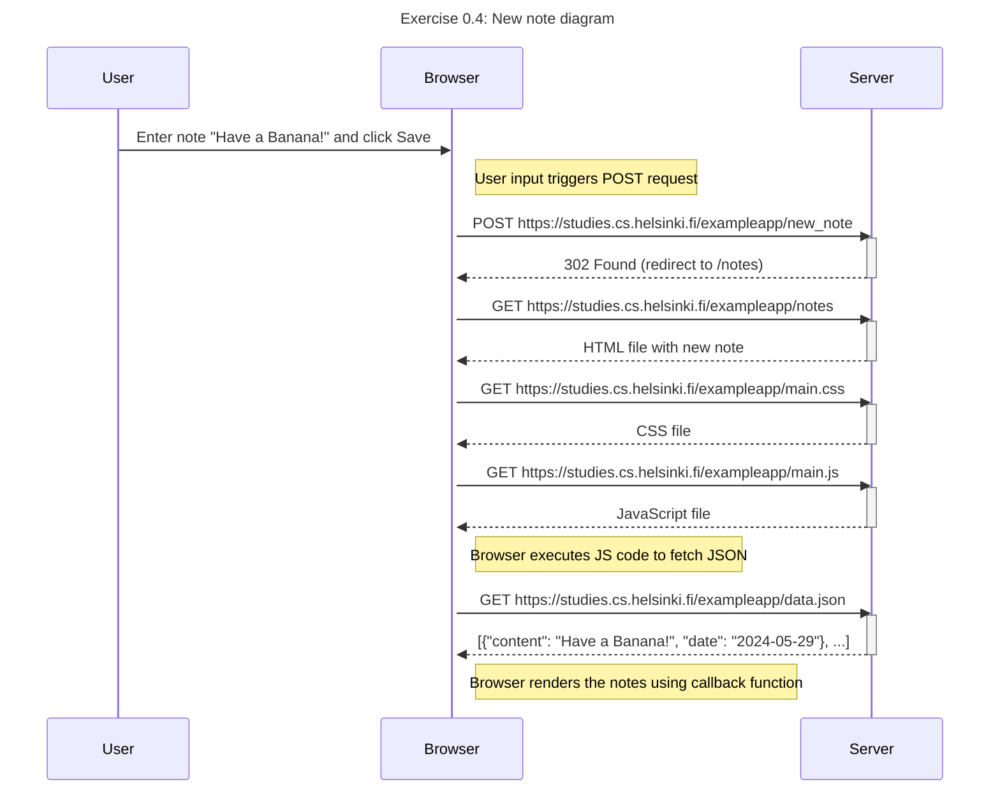

 

```mermaid
sequenceDiagram
    title: Exercise 0.4: New note diagram
    participant User
    participant Browser
    participant Server

    User->>Browser: Enter note "Have a Banana!" and click Save
    activate Browser
    Note right of Browser: User input triggers POST request
    Browser->>Server: POST https://studies.cs.helsinki.fi/exampleapp/new_note
    activate Server
    Server-->>Browser: 302 Found (redirect to /notes)
    deactivate Server

    Browser->>Server: GET https://studies.cs.helsinki.fi/exampleapp/notes
    activate Server
    Server-->>Browser: HTML file with new note
    deactivate Server

    Browser->>Server: GET https://studies.cs.helsinki.fi/exampleapp/main.css
    activate Server
    Server-->>Browser: CSS file
    deactivate Server

    Browser->>Server: GET https://studies.cs.helsinki.fi/exampleapp/main.js
    activate Server
    Server-->>Browser: JavaScript file
    deactivate Server

    Note right of Browser: Browser executes JS code to fetch JSON
    Browser->>Server: GET https://studies.cs.helsinki.fi/exampleapp/data.json
    activate Server
    Server-->>Browser: [{"content": "Have a Banana!", "date": "2024-05-29"}, ...]
    deactivate Server

    Note right of Browser: Browser renders the notes using callback function

```
