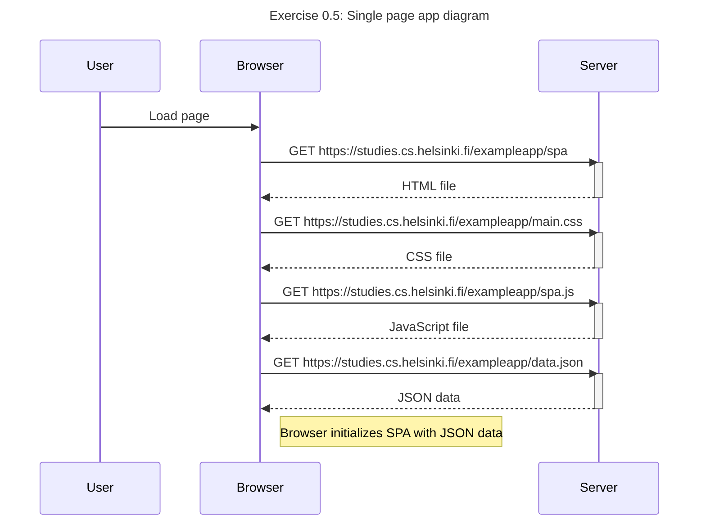

```mermaid
sequenceDiagram
    title: Exercise 0.5: Single page app diagram

    participant User
    participant Browser
    participant Server

    User->>Browser: Load page
    Browser->>Server: GET https://studies.cs.helsinki.fi/exampleapp/spa
    activate Server
    Server-->>Browser: HTML file
    deactivate Server

    Browser->>Server: GET https://studies.cs.helsinki.fi/exampleapp/main.css
    activate Server
    Server-->>Browser: CSS file
    deactivate Server

    Browser->>Server: GET https://studies.cs.helsinki.fi/exampleapp/spa.js
    activate Server
    Server-->>Browser: JavaScript file
    deactivate Server

    Browser->>Server: GET https://studies.cs.helsinki.fi/exampleapp/data.json
    activate Server
    Server-->>Browser: JSON data
    deactivate Server

    Note right of Browser: Browser initializes SPA with JSON data
```
